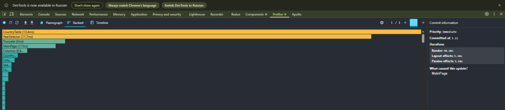
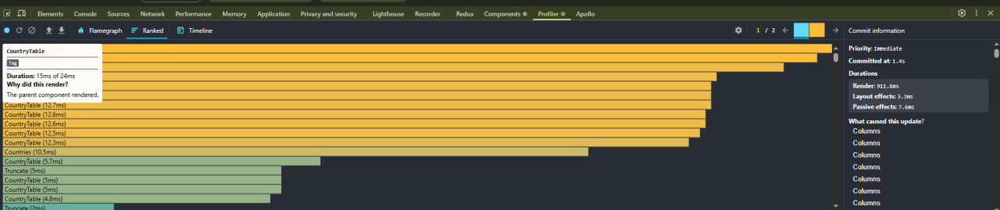
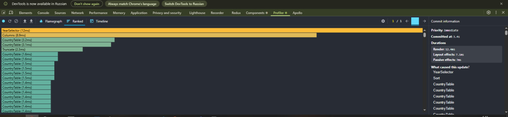
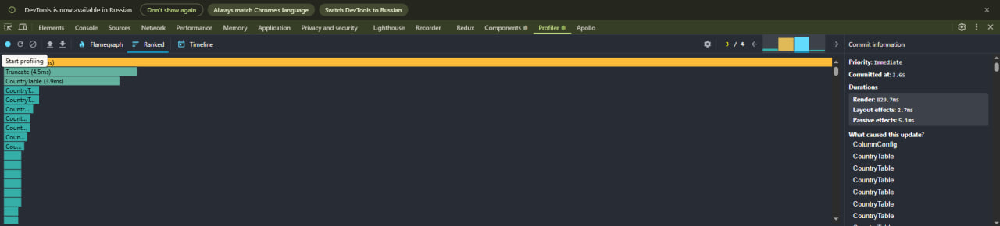
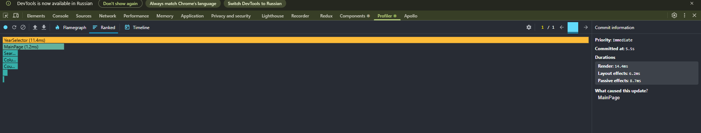
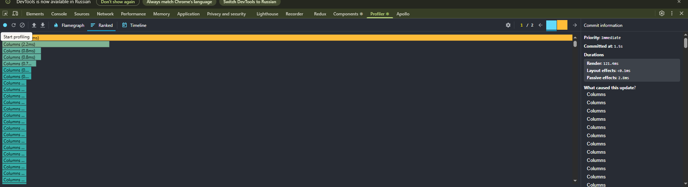
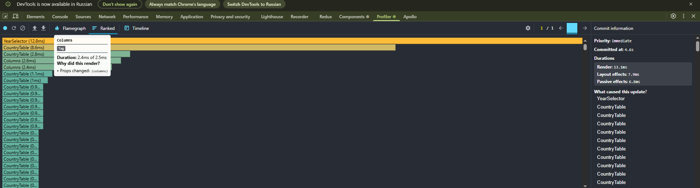
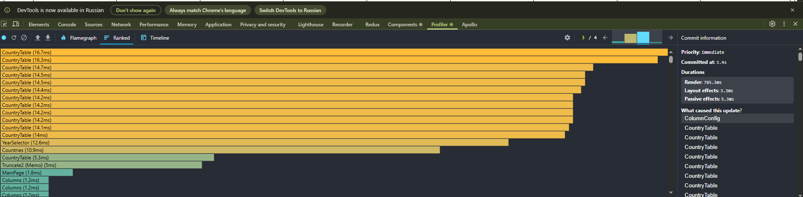

# You can use ready json file for faster checks

uncomment necessary lines in src\api\co2.ts

# Initial Profiling with React Dev Tools Profiler

search by name: 14.4 ms
sorting: 121.4 ms
filtering by year: 13.1 ms
updating columns: 785.3 ms

Initial Load:

Initial Load (ranked):

Search: 
Sorting: 
Filtering by year: 
updating columns: 

# Update the App with React.memo and useMemo

search by name: 14.4 ms
sorting: 121.4 ms
filtering by year: 13.1 ms
updating columns: 785.3 ms

Initial Load:

Initial Load (ranked):

Search: 
Sorting: 
Filtering by year: 
updating columns: 